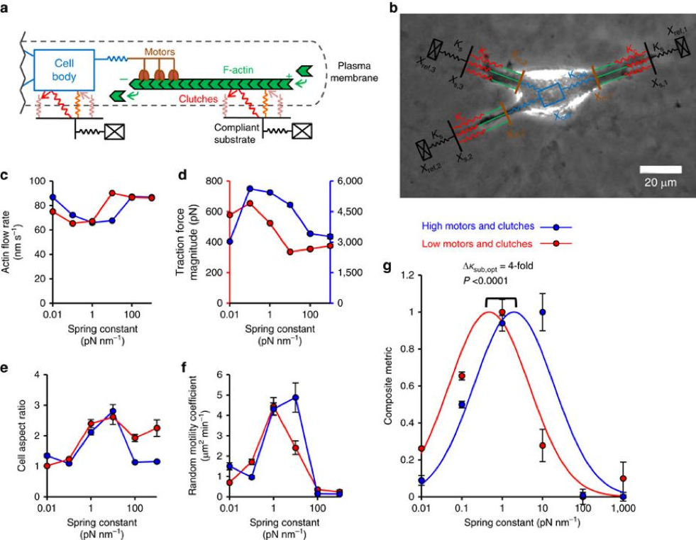
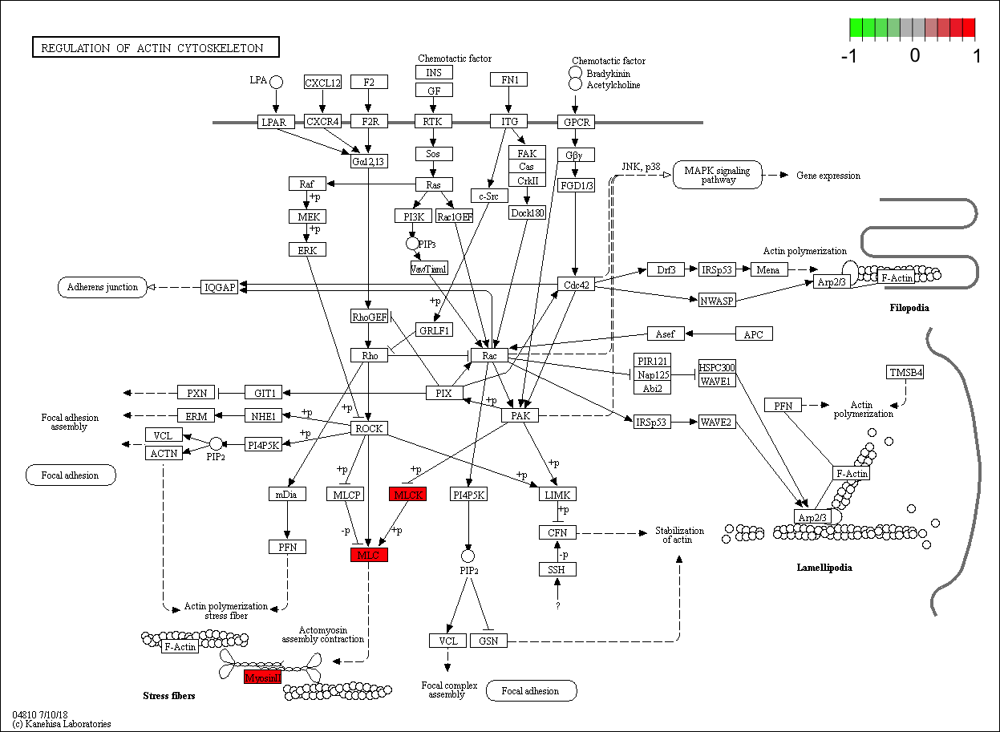

```{r setup, include=FALSE, message=FALSE}
knitr::opts_chunk$set(echo = TRUE)

set_basepath <- function(type = c("data", "R")) {
  if (stringr::str_length(Sys.which("rstudio-server"))) {
    file.path("/home/shared", type)
  } else {
    here::here(type)
  }
}

data_dir <- set_basepath("data")
scripts_dir <- set_basepath("R")
source(file.path(scripts_dir, "submission_helpers.R"))
```

```{r}
library(pathview)
library(broom)
library(tidyverse)
```

# About this activity

The title of this activity is slightly misleading, as we'll spend more time using genomics and motility data analysis to test hypotheses that we generated *based on* the **Cell Migration Simulator (CMS)** model — rather than the other way around. However, we'll try to give you some sense for how might use trends or insights from the data to adjust or create new models.

Instead of fitting a bunch of statistical models, we'll spend a lot of time inspecting and visualizing the data to answer our questions. This is partly due to the small sample size in the **PS-ON Cell Line data** that prohibits any sort of robust statistical modeling. Still, careful (and sometimes creative) exploration of measurements and outcomes is an important part of any analysis — and this exploration can often reveal some pretty useful information!

We'll also use this activity as an excuse to introduce you to concepts and coding style from what's known as the [**"tidyverse"**](https://www.tidyverse.org/). While the code might seem strange compared to what you've seen in other modules, tools in the tidyverse can be incredibly powerful — and fun! — to work with. Check out this great tutorial if you want to learn more: https://tidyverse-intro.github.io/.

---

# Loading the data

Let's load the PS-ON cell line data and start off by taking a closer look at how to examine differences in motility across conditions.


```{r, warning=FALSE}
load(file.path(data_dir, "pson_expr_tpm_df.RData"))
load(file.path(data_dir, "pson_expr_gene_info.RData"))
load(file.path(data_dir, "pson_motility_tidy_df.RData"))
```

Use your favorite function to take a peek at the content of `pson_motility_tidy_df` (`str()` is always a good choice, or you could also try out `glimpse()` from one of the tidyverse packages called **dplyr**).

```{r}
str(pson_motil_tidy_df)
```

It may be obvious from inspecting the overall dataframe, but we can see that this table includes data for several different cell lines. The `distinct()` function is a handy way to summarize which diagnosis values are included:

```{r}
distinct(pson_motil_tidy_df, diagnosis)
```

We can add a second variable to the `distinct()` command to view the specific cell lines that are associated with each diagnosis.

```{r}
distinct(pson_motil_tidy_df, diagnosis, cellLine)
```

To simplify things a bit, we'll just focus on the two breast cancer cell lines. You've seen a variety of ways to subset data in R, but we'll now try out `filter()` to select only the *rows* from our dataframe that match the condition we specify.

```{r}
filter(pson_motil_tidy_df, diagnosis == "Breast Cancer")
```

Here's where things start to get a little strange... From this point on, you'll be seeing a lot more of a little symbol that looks like `%>%`. This is known as the "pipe" operator, and it basically tells R to "take the thing to my left" and then "pass it as the first argument to the function on my right." You can see how this works using the same filter command as we used above, just arranged a bit differently.

```{r}
pson_motil_tidy_df %>% filter(diagnosis == "Breast Cancer")
```

The pipe can be really nice for interactive analyses, where we might chain together a series of steps to modify or visualize different pieces of data. When we use the pipe, we can avoid saving lots of extra variables for intermediate steps — or worse, writing ugly nested functions.

---

# Exploring outcome data

Ultimately, we're interested in making some conclusions about cell motility in different conditions. Given that motility is the outcome we care about, we should start by taking a closer look at how it's measured and reported in the PS-ON dataset.

For those of you who are familiar with SQL queries, some of the functions from **dplyr** will seem familiar. Here, we're going to "group" the rows in our filtered data frame based on the cell line ID and each of the three motility metrics; we'll then calculate the average of these metrics across all conditions using the `summarize()` function. 

```{r}
pson_motil_tidy_df %>% 
  filter(diagnosis == "Breast Cancer") %>% 
  group_by(cellLine, summary_metric) %>% 
  summarize(overall_metric = mean(average_value))
```

It seems pretty clear that — by any metric — the **MDA-MB-231** cell line is more "motile" than **T-47D**; however, if we recall the simulation results from the CMS, motility can vary widely between conditions. 

## Choosing a motility metric

So again, we have 3 different motility metrics for each condition (if we add `experimentalCondition` to our `group_by` arguments, then `summarize` will break the results down by this variable as well). It'd be nice if we could work with a single indicator of motility.

```{r}
pson_motil_tidy_df %>% 
  filter(diagnosis == "Breast Cancer") %>% 
  group_by(cellLine, summary_metric, experimentalCondition) %>% 
  summarize(overall_metric = mean(average_value))
```

Let's start to visualize the motility metrics. We'll use the **ggplot2** graphing library, which has become the go-to visualization tool for many R users. We won't get into the details of using `ggplot()` (it can take a little while to get the hang of), but give brief summaries of what's happening. In the code chunk below, we're building a plot with `cellLine` on the x-axis, our averaged motility metrics on the `y-axis` — and by adding a column or "col" layer, ggplot will automatically sum up y-values for each x-value.

```{r}
pson_motil_tidy_df %>% 
  filter(diagnosis == "Breast Cancer") %>% 
  group_by(cellLine, summary_metric, experimentalCondition) %>% 
  summarize(overall_metric = mean(average_value)) %>% 
  ggplot(aes(x = cellLine, y = overall_metric)) + 
  geom_col()
```

Lumping everything together by cell line isn't particularly informative. We can add some color to show the values for different conditions.

```{r}
pson_motil_tidy_df %>% 
  filter(diagnosis == "Breast Cancer") %>% 
  group_by(cellLine, summary_metric, experimentalCondition) %>% 
  summarize(overall_metric = mean(average_value)) %>% 
  ggplot(aes(x = cellLine, y = overall_metric)) + 
  geom_col(aes(fill = experimentalCondition))
```

That's better, but the "stacked" bars are tough to compare by eye. We can tell ggplot to make the columns "dodge" one another so that they're plotted side-by-side.

```{r}
pson_motil_tidy_df %>% 
  filter(diagnosis == "Breast Cancer") %>% 
  group_by(cellLine, summary_metric, experimentalCondition) %>% 
  summarize(overall_metric = mean(average_value)) %>% 
  ungroup() %>% 
  ggplot(aes(x = cellLine, y = overall_metric)) + 
  geom_col(aes(fill = experimentalCondition), position = "dodge")
```

Better! However, we're still missing information about differences (or similarities) between the three different metrics. When we have categories or "facets" like this to compare, we can use `facet_wrap` to easily create sub-plots for each category.

```{r}
pson_motil_tidy_df %>% 
  filter(diagnosis == "Breast Cancer") %>% 
  group_by(cellLine, summary_metric, experimentalCondition) %>% 
  summarize(overall_metric = mean(average_value)) %>% 
  ungroup() %>% 
  ggplot(aes(x = cellLine, y = overall_metric)) + 
  geom_col(aes(fill = experimentalCondition), position = "dodge") +
  facet_wrap(~ summary_metric)
```

Now we're getting somewhere. While the scales are a bit different for each metric, the trends across conditions and cell lines look remarkably similar. We might be able to take advantage of this redundancy to better summarize motility.

Let's transform the data a bit so that we can more directly compare motility metrics. The ggplot functions (and a lot of other tools in the tidyverse) rely on information being consistently organized in *columns*. This gets to the core principles of [**"tidy data"**](https://en.wikipedia.org/wiki/Tidy_data), which you can check out if you're curious.

Similar to the filter function for rows, we can use `select()` to pick out specific columns.

```{r}
pson_motil_tidy_df %>% 
  filter(diagnosis == "Breast Cancer") %>%
  select(summary_metric, average_value)
```

If you've ever worked with pivot tables in Excel, the **tidyr** package provides the `gather()` and `spread()` functions for converting data into "long" or "wide" format, respectively.

```{r}
pson_motil_tidy_df %>% 
  filter(diagnosis == "Breast Cancer") %>%
  select(cellLine, experimentalCondition, summary_metric, average_value) %>% 
  spread(summary_metric, average_value)
```

Can you see what the `spread` function did here?


Back to plotting... Let's make a simple scatter plot of "total distance" values versus "speed" values. Just like bar plots, we can customize colors and even shapes to show the different conditions and cell lines. As long as our input dataframe is properly formatted, ggplot can easily map values to different aesthetic properties.

```{r}
pson_motil_tidy_df %>% 
  filter(diagnosis == "Breast Cancer") %>%
  select(cellLine, experimentalCondition, summary_metric, average_value) %>% 
  spread(summary_metric, average_value) %>% 
  ggplot(aes(x = speed_um_hr, y = total_distance_um)) +
  geom_point(aes(colour = experimentalCondition, shape = cellLine), size = 3)
```

Seems pretty correlated... ggplot also provides layers for adding best fit lines (note that the `method = "lm"` option here is telling `geom_smooth` to use a linear model and fit a straight line — just like with the `lm()` function):

```{r}
pson_motil_tidy_df %>% 
  filter(diagnosis == "Breast Cancer") %>%
  select(cellLine, experimentalCondition, summary_metric, average_value) %>% 
  spread(summary_metric, average_value) %>% 
  ggplot(aes(x = speed_um_hr, y = total_distance_um)) +
  geom_point(aes(colour = experimentalCondition, shape = cellLine), size = 3) +
  geom_smooth(method = "lm")
```

We'll get a little more advanced here and look at the pairwise correlation between each of the three metrics. Don't worry too much about what the code is doing here — but appreciate that it doesn't take much to achieve what sounds like a fairly complex task!

```{r}
pson_motil_tidy_df %>% 
  filter(diagnosis == "Breast Cancer") %>%
  select(cellLine, experimentalCondition, summary_metric, average_value) %>% 
  group_by(summary_metric, cellLine) %>% 
  mutate(average_value_norm = average_value / max(average_value)) %>% 
  ungroup() %>% 
  left_join(., ., by = c("cellLine", "experimentalCondition")) %>% 
  ggplot(aes(x = average_value_norm.x, y = average_value_norm.y)) +
  geom_point(aes(colour = experimentalCondition, shape = cellLine)) +
  geom_smooth(method = "lm") +
  coord_equal() + 
  facet_grid(summary_metric.x ~ summary_metric.y)
```

Based on the strong correlation between all metrics, it seems like we should be safe in collapsing into one. Alternatively, we could just choose one of the three. Here though, we'll "normalize" each so that it's on a scale of 0 to 1, then take the average across all three.

Note that we're missing some stiffness information for two of the surface conditions: "hyaluronic acid" and "glass." We can find more details about the PS-ON experiments to fill in this information: https://nciphub.org/groups/nci_physci/wiki/PSON0009. While no specific stiffness value is reported for glass, we can give a ballpark value based on other resources — key point is that glass is much stiffer!

```{r}
brca_motility_df <- pson_motil_tidy_df %>% 
  filter(diagnosis == "Breast Cancer") %>%
  group_by(summary_metric, cellLine) %>% 
  mutate(average_value_norm = average_value / max(average_value)) %>% 
  ungroup() %>% 
  mutate(stiffness_norm = case_when(
    surface == "HyaluronicAcid" ~ 0.5, 
    surface == "Glass" ~ 1000,
    TRUE ~ stiffness_norm
  )) %>% 
  select(-summary_metric, -average_value, -average_value_scaled,
         -standard_deviation, -standard_error) %>% 
  nest(average_value_norm) %>% 
  mutate(motility = map_dbl(data, ~ colMeans(., na.rm = TRUE))) %>% 
  select(-data)
```

Now that we have a subsetted and updated dataframe, we can get back to our exploration of motility with respect to condition.


## Examining differences in motility

While we still have a lot of information to interpret, we can try to summarize at least a few layers of differences with a carefully constructed plot. Below, we use a combination of colors, transparency, shape sizes (bar height), and subplots to convey a bunch of info in one plot. While there are pros and cons to maximizing "information density" in figures, it can be helpful for exploratory analysis to get a birds-eye view of the data.

```{r}
brca_motility_df %>% 
  ggplot(aes(x = cellLine, y = motility)) +
  geom_col(aes(alpha = log10(stiffness_norm), fill = laminate), 
           colour = "black", position = "dodge") +
  scale_alpha_continuous("stiffness [log-kPa]", range = c(0.5, 1)) +
  facet_grid( ~ surface * stiffness_norm, scales = "free_y")
```

In this case, it's hard to draw any conclusions from the plot. We can look at it a slightly different way to summarize the distribution of motility values for different surface stiffnesses.

```{r}
brca_motility_df %>% 
  ggplot(aes(x = cellLine, y = motility)) +
  geom_boxplot(aes(colour = cellLine)) +
  facet_wrap(~ stiffness_norm)
```

While boxplots tend to be less misleading than bar plots, they can still mask details of the underlying data. Can you think of what might be a problem with the differences shown above?


By plotting the data points along with the boxplots, we can see the sample size associated with each "distribution." We probably shouldn't feel super confident about the median values seen for each stiffness and cell line, given that we only have between 1 and 4 observations for each.

```{r}
brca_motility_df %>% 
  ggplot(aes(x = cellLine, y = motility)) +
  geom_boxplot(aes(fill = cellLine), alpha = 0.2, outlier.alpha = 0) +
  geom_jitter(aes(colour = cellLine), width = 0.25) +
  facet_wrap(~ stiffness_norm)
```


In the CMS publication, they simulated motility for different stiffness levels on *the same surface*. We can take a similar approach and focus on the polyacrymalide gel conditions to (hopefully) clear up our picture.

```{r}
brca_motility_df %>% 
  filter(surface == "polyacrylamide") %>% 
  ggplot(aes(x = cellLine, y = motility)) +
  geom_boxplot(aes(fill = cellLine), alpha = 0.2, outlier.alpha = 0) +
  geom_jitter(aes(colour = cellLine), width = 0.25) +
  facet_wrap(~ stiffness_norm)
```

While the medians again are not entirely reliable, the trend seems reminiscent of the CMS results: one of the cell lines shows slightly greater motility at low stiffness, while the other cell line shows clearly greater motility at higher stiffness.

---

# Loading & formatting expression data

What we'd like to know now is whether the differences in motility with respect to stiffness can be explained by the abundance of motors and clutches in each cell line. To answer this, we'll take a look at the expression of genes related to these components.

We'll go ahead and load the expression and log-transform the values.

```{r}
pson_logtpm_df <- pson_expr_tpm_df %>% 
  mutate_at(vars(starts_with("mRNA")), ~ log2(. + 1))

pson_logtpm_df[1:5, 1:5]
```

---

# mini-DREAM Challenge

**QUESTION:** Do expression differences in motility genes across stiffness conditions match the predictions of CMS simulations?

Recall the results shown in Figure 6F from the CMS publication:

```{r}

```


## Estimating motor and clutch abundance

To shortcut things a bit, we've grabbed data for genes belonging to one of two categories: myosin (~ clutches) and cell adhesion (~ motors). We'll use these categories to represent the red and blue lines from the figure.

```{r}
myosin_genes <- gene_df %>% 
  filter(str_detect(description, "myosin")) %>% 
  dplyr::select(gene_id, symbol, description) %>% 
  mutate(gene_type = "myosin")

cell_adhesion_genes <- gene_df %>% 
  filter(str_detect(description, "cell adhesion")) %>% 
  dplyr::select(gene_id, symbol, description) %>% 
  mutate(gene_type = "cell adhesion")

motorclutch_tpm_df <- bind_rows(myosin_genes, cell_adhesion_genes) %>%
  left_join(pson_logtpm_df, by = "gene_id")

brca_motorclutch_df <- motorclutch_tpm_df %>% 
  gather(sample, logtpm, starts_with("mRNA")) %>% 
  right_join(brca_motility_df, by = "sample")
brca_motorclutch_df
```

How many genes did we end up including for each category?

```{r}
# fill in the command to "group" rows "by" gene_type, 
# then count distinct values
brca_motorclutch_df %>% 
  _____(gene_type) %>% 
  summarize(count = n_distinct(symbol))
```

```{r}
# fill in the number of genes for each type
my_celladhesion_count <- 0
my_myosin_count <- 0
```

Let's take a look at the plot.

```{r}
brca_motorclutch_df %>% 
  filter(logtpm > 0, surface == "polyacrylamide") %>% 
  ggplot(aes(x = cellLine, y = logtpm)) +
  geom_jitter(aes(colour = gene_type)) +
  geom_boxplot(alpha = 0.2)
```

It's a little tough to tell, but it seems like the expression of our clutch and motor genes might be higher in one cell line than the other. Based on your interpretation of the plot, which cell line should we regard as our "high motors and clutches" (blue line) class?

```{r}
# select either "MDA-MB-231" or "T-47D"
my_high_cellline <- "T-47D"


brca_motility_df %>% 
  filter(surface == "polyacrylamide") %>% 
  mutate(motors_clutches = if_else(cellLine == my_high_cellline, 
                                   "high", "low")) %>% 
  ggplot(aes(x = cellLine, y = motility)) +
  geom_boxplot(aes(fill = motors_clutches), alpha = 0.2, outlier.alpha = 0) +
  geom_jitter(aes(colour = motors_clutches), width = 0.25) +
  scale_color_manual(values = c("blue", "red")) +
  scale_fill_manual(values = c("blue", "red")) +
  facet_wrap(~ stiffness_norm)
```

Does the trend here match the results from the CMS figure? Elaborate on your answer, and provide an explanation for why you might expect to see what you see.

```{r}
# select "yes" or "no"
my_match <- ""

my_explanation <- ""
```


We can also use the `pathview()` package to visualize the expression of our genes directly on a KEGG map for the ["Regulation of actin skeleton" pathway](https://www.genome.jp/kegg-bin/show_pathway?map=hsa04810&show_description=show).

```{r, warning=FALSE}
brca_motorclutch_df %>% 
  filter(surface == "polyacrylamide") %>% 
  left_join(gene_df) %>% 
  dplyr::select(entrez, sample, logtpm) %>% 
  spread(sample, logtpm) %>%
  column_to_rownames("entrez") %>%
  as.matrix() %>% 
  pathview(pathway.id = "hsa04810", new.signature = FALSE)
```

```{r}

```

How many genes from our data show up in the pathway map (red boxes)? How does this influence your interpretation of the results and our approach?

```{r}
my_pathway_count <- 0

my_takeway <- ""
```

## Submitting the prediction

You're now ready to submit the prediction. Just run the chunk below, a file with your prediction will be uploaded to Synapse and submitted to the challenge. You'll be able to see the results of your prediction on the mini-DREAM scoreboards, with the submission ID that gets printed below.

```{r}
library(synapser)

# If you didn't submit an answer for a previous module, remove the '#'s
# on the next 2 lines and enter your Synapse username and password
# before running this chunk.

# synLogin('my_synapse_username', 'my_synapse_password',
#          rememberMe = TRUE, silent = TRUE)

# If you submitted for any earlier modules, this should work.
synLogin(silent = TRUE)
submission <- submit_module_answers(module = 7)
```

Congrats — you’ve reached the end of **Module 4**! You can now return to the **mini-DREAM Challenge** site on Synapse.

---

# Bonus — tidyverse PCA

Below is a quick example of how we can perform Principal Components Analysis (PCA) using functions and plotting tools from the tidyverse.

```{r, warning=FALSE}
pson_logtpm_mat <- pson_logtpm_df %>% 
  column_to_rownames("gene_id") %>% 
  as.matrix()

pson_logtpm_mat[1:5, 1:5]
```

```{r}
pson_logtpm_pca <- pson_logtpm_mat %>% 
  t() %>% 
  prcomp()

pc_df <- tidy(pson_logtpm_pca, "pcs")

pson_logtpm_pca_df <- pson_logtpm_pca %>% 
  tidy("samples") %>% 
  filter(PC <= 2)
```


```{r}
pson_logtpm_pca_df %>% 
  left_join(select(pson_motil_tidy_df, sample, diagnosis), 
            by = c("row" = "sample")) %>% 
  distinct() %>% 
  spread(PC, value) %>% 
  ggplot(aes(x = `1`, y = `2`)) +
  geom_point(aes(colour = diagnosis))
  
```

```{r}
pc1_label <- pc_df %>% 
    filter(PC == 1) %>% 
    transmute(label = sprintf("PC%s [%0.2f%%]", PC, 100*percent)) %>% 
    flatten_chr()

pc2_label <- pc_df %>% 
    filter(PC == 2) %>% 
    transmute(label = sprintf("PC%s [%0.2f%%]", PC, 100*percent)) %>% 
    flatten_chr()

brca_motility_df %>% 
  left_join(pson_logtpm_pca_df, by = c("sample" = "row")) %>% 
  spread(PC, value) %>% 
  ggplot(aes(x = `1`, y = `2`)) +
  geom_point(aes(colour = motility, shape = cellLine), 
             size = 3, alpha = 0.8) +
  xlab(pc1_label) +
  ylab(pc2_label)
```


